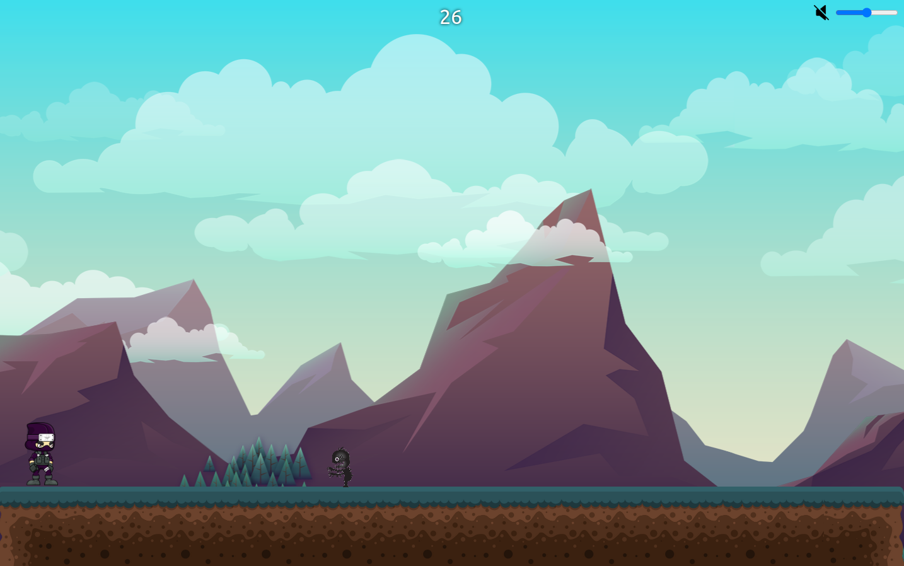

# 🥷 Shadow Runner - 2D Game

**Shadow Runner** is a fast-paced, engaging 2D endless running game built using **HTML**, **CSS**, **JavaScript**, and bundled with **Vite** for modern and efficient development. The player controls a shadow character, jumping over obstacles and running as far as possible while avoiding traps. The goal is to achieve the highest score!

## ✨ Features

- **Endless Runner Gameplay**: The game dynamically generates obstacles for endless replayability.
- **Smooth Controls**: Jump, dodge, and run with responsive key controls.
- **Dynamic Difficulty**: As the player progresses, the game speed and difficulty increase.
- **Score Tracking**: Keep track of your best score and strive to beat it each time!
- **Responsive Design**: Optimized for play on desktop and mobile browsers.

## 🛠 Technologies Used

-  **HTML**: For structuring the game elements and canvas.
-  **CSS**: For styling and designing game aesthetics.
-  **JavaScript**: The core logic for the game mechanics (player controls, collision detection, score tracking).
-  **Vite**: A fast development server and build tool for optimizing the project.

## ⚙️ How It Works

1. **Start Game**: The player starts by pressing the "Start" button or using a keyboard shortcut.
2. **Run and Jump**: Use the keyboard to control the shadow character, jumping over obstacles.
3. **Avoid Obstacles**: Dodge various traps and enemies that spawn dynamically.
4. **Track Your Score**: The game tracks the player's current score and displays it on the screen.
5. **Game Over**: If the player hits an obstacle, the game ends, and the final score is displayed. Players can restart to try again.

## 📸 Screenshots




## 📦 Installation

### To run the game locally, follow these steps:

1. **Clone the repository**:
   ```bash
   git clone https://github.com/yourusername/shadow-runner-game.git

2. **Navigate to the project directory:**
   ```
   cd shadow-runner-game

3. **Install dependencies:**
   ```
   npm install

4. **Run the development server:**
   ```
   npm run dev

## 🚀 Usage
- Launch the game by starting the Vite server, as explained above.
- Play the game directly in your browser, whether on desktop or mobile.
- Customize the game assets, difficulty, or controls by editing the JavaScript and CSS files.
- Build the project for production using:
- bash
- Copy code
- npm run build
- The game will be optimized for deployment and output in the dist folder.

## 🎨 Customization
- Game Assets: Update the background, character, and obstacle images by replacing files in the assets/ folder.
- Game Logic: Modify the difficulty, speed, and other game mechanics by editing the game.js file in the src/ directory.
- Styling: Customize the look and feel of the game by adjusting the style.css file.

## 📝 Version
1.0.0

## License
This project is licensed under the MIT License. See the LICENSE file for more details.

## 📧 Contact
For any inquiries, feel free to contact me at:
Tharindu Rukshan:
tharindurukshan709@gmail.com